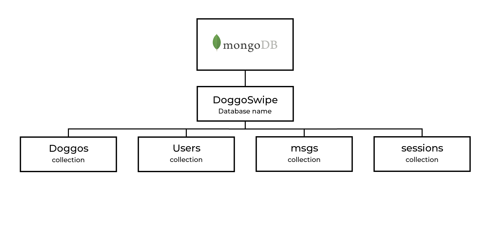

# 🐶 Team Pugs

Welcome to our team-project! We are team pugs and we've build this app called DoggoSwipe. Each of us has individually built a feature. DoggoSwipe consists out of all the features and topics we've been working on within these few weeks. You can read more documentation in our [wiki](https://github.com/samanthavz/team-tech/wiki) (written in dutch).

# 📄 description and concept

DoggoSwipe is a tinder-like app for dogs. You can easily register or log in and start swiping. Through this app you will be able to find lots and lots of cute dogs for you to adopt. Each of our team members has built a feature within this app. We have also done some research and added multiple topics/stategies. It will contain the following:

### features

- Register and/or login
- Liking and disliking
- Filtering
- Deleting
- Chatting
- Profile editting

### topics

- MVC ([Samantha van Zandwijk](https://github.com/samanthavz))
- API ([Samantha van Zandwijk](https://github.com/samanthavz))
- Chatting with socket.io ([Martijn van der Lans](https://github.com/MartijnvdLans))
- User authentication with passport.js ([Jabir Tisoudali](https://github.com/jabirtisou))
- Mongoose ([Zain Butt](https://github.com/zainuwachtig))

 ## 🤖 Used technologies

We have used different technologies to build our app. It is made with CSS and JavaScript, but instead of HTML we've used a templating engine. See the following included technologies:

 * [Node.js](https://nodejs.org/en/)
 * [Express](https://www.npmjs.com/package/express)
 * [pug](https://pugjs.org/api/getting-started.html)
 * [Dog API]()
 * [MongoDB](https://www.mongodb.com/)

 ---

# 💻 How to install

Want to start up our app and you have no idea how? Follow the next steps! (if you are a pro already, you can skip the pre-installation).
## 🔨 Pre-installation:
#### NODE.js
* [Install NodeJs](https://nodejs.org/en/download/)
* Type ```node install``` in your terminal
* Or use ```node --version``` to check if you have node on your computer

#### GIT
* Type ```git install``` in your terminal
* Or use ```git --version``` to check if you have GIT on your computer

---
## 🔨 App installation:
#### Clone this repo:
* ```git clone https://github.com/samanthavz/team-tech.git```

#### Install NPM:
* [Install NPM](https://www.npmjs.com/get-npm) in the root of the project:
``` npm install ```

#### Start node:
* ```npm start```

---
# 📊 Database

The database used for this app is [MongoDB](https://www.mongodb.com/). See the following structure:



# 🎫 License

[MIT License](https://github.com/samanthavz/team-tech/blob/main/LICENSE)


### 🙋‍♀️ contributors

- [Samantha van Zandwijk](https://github.com/samanthavz)
- [Jabir Tisoudali](https://github.com/jabirtisou)
- [Martijn van der Lans](https://github.com/MartijnvdLans)
- [Zain Butt](https://github.com/zainuwachtig)

